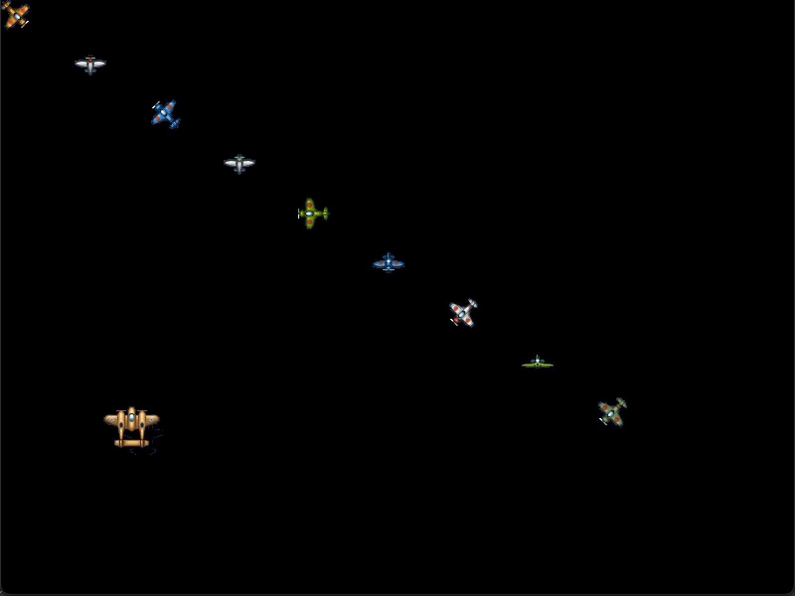

# ganim8

Sprite Animation library for [Ebitengine](https://ebiten.org/) inspired by [anim8](https://github.com/kikito/anim8).

v1.x is pretty much the same API with [anim8](https://github.com/kikito/anim8).
v2.x is more optimized for Ebiten to be more performant and granular control introducing [Sprite](https://pkg.go.dev/github.com/yohamta/ganim8/v2#Sprite) API.

In order to build animations more easily, ganim8 divides the process in two steps: first you create a grid, which is capable of creating frames (Quads) easily and quickly. Then you use the grid to create one or more animations.

[GoDoc](https://pkg.go.dev/github.com/yohamta/ganim8/v2)

## Example

```go
import "github.com/yohamta/ganim8/v2"

type Game struct {
  animation *ganim8.Animation
}

func NewGame() *Game {
  g := &Game{ prevTime: time.Now() }

  g32 := ganim8.NewGrid(32, 32, 1024, 1024)
  g.animation = ganim8.New(monsterImage, g32.Frames("1-5", 5), 100*time.Millisecond)

  return g
}

func (g *Game) Draw(screen *ebiten.Image) {
  screen.Clear()
  g.animation.Draw(screen, ganim8.DrawOpts(screenWidth/2, screenHeight/2, 0, 1, 1, 0.5, 0.5))
}

func (g *Game) Update() error {
  g.animation.Update()
  // Note: it assumes that the time delta is 16ms by default 
  //       if you need to specify different delta you can use Animation.UpdateWithDelta(delta) instead
  return nil
}
```

You can see a more elaborated [example](examples/demo/main.go).

That demo transforms this spritesheet:


Into several animated objects:



## Explanation

### Grids

Grids have only one purpose: To build groups of quads of the same size as easily as possible. In order to do this, they need to know only 2 things: the size of each quad and the size of the image they will be applied to. Each size is a width and a height, and those are the first 4 parameters of @ganim8.NewGrid@.

Grids are just a convenient way of getting frames from a sprite. Frames are assumed to be distributed in rows and columns. Frame 1,1 is the one in the first row, first column.

This is how you create a grid:

```go
ganim8.NewGrid(frameWidth, frameHeight, imageWidth, imageHeight, left, top, border)
```

* `frameWidth` and `frameHeight` are the dimensions of the animation *frames* - each of the individual "sub-images" that compose the animation. They are usually the same size as your character (so if the character is
    32x32 pixels, `frameWidth` is 32 and so is `frameHeight`)
* `imageWidth` and `imageHeight` are the dimensions of the image where all the frames are.
* `left` and `top` are optional, and both default to 0. They are "the left and top coordinates of the point in the image where you want to put the origin of coordinates of the grid". If all the frames in your grid are
  the same size, and the first one's top-left corner is 0,0, you probably won't need to use `left` or `top`.
* `border` is also an optional value, and it also defaults to zero. What `border` does is allowing you to define "gaps" between your frames in the image. For example, imagine that you have frames of 32x32, but they
  have a 1-px border around each frame. So the first frame is not at 0,0, but at 1,1 (because of the border), the second one is at 1,33 (for the extra border) etc. You can take this into account and "skip" these borders.

To see this a bit more graphically, here are what those values mean for the grid which contains the "submarine" frames in the demo:


Grids only have one important method: `Grid.Frames(...)`.

`Grid.Frames` accepts an arbitrary number of parameters. They can be either numbers or strings.

* Each two numbers are interpreted as quad coordinates in the format `(column, row)`. This way, `grid.Frames(3,4)` will return the frame in column 3, row 4 of the grid. There can be more than just two: `grid.Frames(1,1, 1,2, 1,3)` will return the frames in {1,1}, {1,2} and {1,3} respectively.
* Using numbers for long rows or columns is tedious - so grids also accept strings indicating range plus a row/column index. Diferentiating rows and columns is based on the order in which the range and index are provided. A row can be fetch by calling `grid.Frames("range", rowNumber)` and a column by calling `grid.Frames(columnNumber, "range")`. The previous column of 3 elements, for example, can be also expressed like this: `grid.Frames(1,"1-3")`. Again, there can be more than one string-index pair (`grid.Frames(1,"1-3", "2-4",3)`)
* It's also possible to combine both formats. For example: `grid.Frames(1,4, 1,"1-3")` will get the frame in {1,4} plus the frames 1 to 3 in column 1

Let's consider the submarine in the previous example. It has 7 frames, arranged horizontally.

If you make its grid start on its first frame (using `left` and `top`), you can get its frames like this:
```go
                  // frame, image,     offsets, border
gs := ganim8.NewGrid(32,98, 1024,768,  366,102,   1)

frames := gs.Frames("1-7",1)
```
However that way you will get a submarine which "emerges", then "suddenly disappears", and emerges again. To make it look more natural, you must add some animation frames "backwards", to give the illusion
of "submersion". Here's the complete list:
```go
frames := gs.Frames("1-7",1, "6-2",1)
```

### Animations

Animations are groups of frames that are interchanged every now and then.

```go
animation := ganim8.New(img, frames, durations, onLoop)
```

* `img` is an image object to use for the animation.
* `frames` is an array of frames ([image.Rectangle](https://pkg.go.dev/image#Rectangle)). You could provide your own quad array if you wanted to, but using a grid to get them is very convenient.
* `durations` is a number or a table. When it's a number, it represents the duration of all frames in the animation. When it's a table, it can represent different durations for different frames. You can specify durations for all frames individually, like this: `[]time.Duration{time.Milliseconds * 100, time.Milliseconds * 500, time.Milliseconds * 100}` or you can specify durations for ranges of frames: `map[string]time.Duration{"3-5": time.Milliseconds * 200}`.
* `onLoop` is an optional parameter which can be a function or a string representing one of the animation methods. It does nothing by default. If specified, it will be called every time an animation "loops". It will have two parameters: the animation instance, and how many loops have been elapsed. The most usual value (apart from none) is the
string 'pauseAtEnd'. It will make the animation loop once and then pause and stop on the last frame.

Animations have the following methods:

```go
animation.Update()
```

Use this inside `Game.Update()` so that your animation changes frames according to the time that has passed.

It assumes that the time delta is 1/60[s] (1/TPS to be exact).
For more details about TPS (ticks per seconds) in Ebitengine is explained [here](https://github.com/tinne26/tps-vs-fps) that is written by [tinne26](https://github.com/tinne26).

If you need to specify delta for update animations, you can use `UpdateWithDelta()` instead:

```go
animation.UpdateWithDelta(delta)
```


```go
animation.Draw(screen, ganim8.DrawOpts(x,y, angle, sx, sy, ox, oy))
```

```go
animation.GoToFrame(frame)
```

Moves the animation to a given frame (frames start counting in 1).

```go
animation.Pause()
```

Stops the animation from updating.

```go
animation.Resume()
```

Unpauses an animation

```go
animation.Clone()
```

Creates a new animation identical to the current one. The only difference is that its internal counter is reset to 0 (it's on the first frame).

```go
animation.Sprite().FlipH()
```

Flips an animation horizontally (left goes to right and viceversa). This means that the frames are simply drawn differently, nothing more.

Note that this method does not create a new animation. If you want to create a new one, use the `Clone` method.

This method returns the animation, so you can do things like `a := ganim8.New(img, g.Frames(1,"1-10"), time.Milliseconds * 100).FlipH()` or `b := a.Clone().FlipV()`.

```go
animation.FlipV()
```

Flips an animation vertically. The same rules that apply to `FlipH` also apply here.

```go
animation.PauseAtEnd()
```

Moves the animation to its last frame and then pauses it.

```go
animation.PauseAtStart()
```

Moves the animation to its first frame and then pauses it.

```go
animation.GetDimensions()
```

Returns the width and height of the current frame of the animation. This method assumes the frames passed to the animation are all quads (like the ones
created by a grid).

## How to contribute?

Feel free to contribute in any way you want. Share ideas, questions, submit issues, and create pull requests. Thanks!
